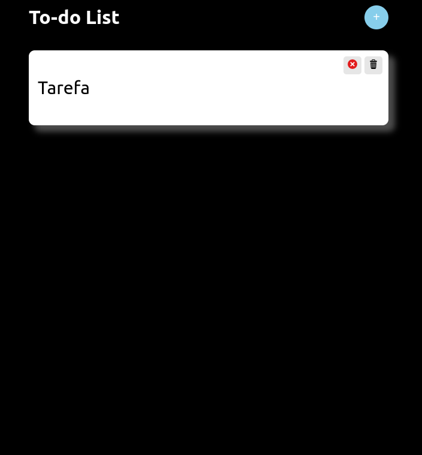

|  |  |
|:-------------:|:------------:|
|  |  |

[Visualizar Página](https://gabrielmorozini.com.br/to-do_list/)

## 📚 Sobre o projeto 
  
  O projeto "To-Do List" é uma aplicação simples e eficiente desenvolvida como parte do curso Programador BR. Utilizando a biblioteca React, esta To-Do List oferece uma interface intuitiva para gerenciar suas tarefas diárias de forma organizada e eficaz.

 

## 🖥️ Tecnologias utilizadas

* REACT 

  

  
  
       

